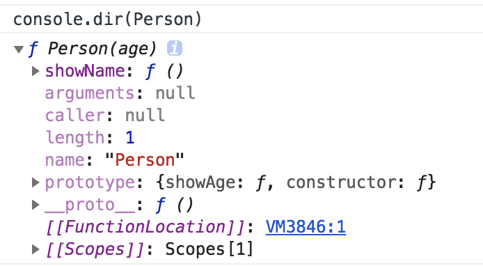
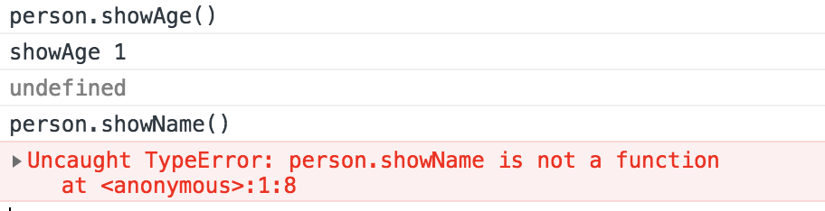

### 原型

首先原型，从一道题目看起

```javascript
function Person(age) {
	this.age = age
}
Person.showName = function() {
	console.log('showName', this.age)
}
Person.prototype.showAge = function() {
	console.log('showAge', '1')
}
let person = new Person()
```


在控制台输出，发现 showAge 方法挂在 prototype 上




然后我们再做一些测试， 发现实例 person 不能使用showName方法，只能使用 showAge， 所以



这时我们明白了一丢丢，实例对象只能用 构造函数 的 __prototype__  里面的属性, 用专业术语来说就是 实例 person 继承了 Person.prototype 里的属性以及方法。 那么我们现在发现第一个问题：  怎么没有看到关于 age  的字眼？ 我们后面来解答

首先我们来解释一下 prototype 是什么，红宝书给出的说明是

> 我们创建的每个函数都有一个 prototype(原型) 属性，这个属性是一个指针，指向一个对象，这个对象的用途是包含可以由特定类型的所有实例共享的属性和方法。 如果通过字面意思来理解，那么prototype就是通过调用构造函数而创造的那个对象实例的原型对象。


